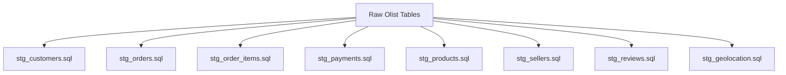
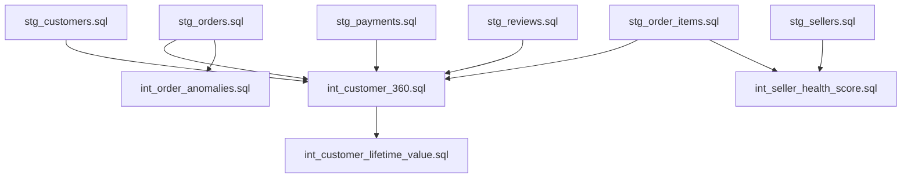
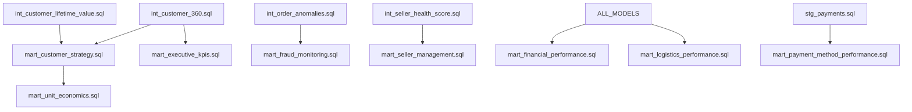

# Olist dbt Project Documentation

## Project Architecture Overview

This dbt project transforms raw Brazilian e-commerce data from Olist into a comprehensive analytics platform. The architecture follows modern Analytics Engineering principles with a medallion approach: Bronze (Raw) → Silver (Staging) → Gold (Marts).

## Data Lineage & Model Dependencies

### Layer 1: Staging Models (Data Standardization & Quality)


**Staging Layer Responsibilities:**
- Data type standardization and timezone conversion
- Data quality scoring and validation
- Surrogate key generation
- Geographic data enrichment
- Incremental processing with merge strategies

**Key Features:**
- Quality threshold enforcement (min 80% score)
- Automated anomaly detection using Z-scores
- Development sampling for faster iterations
- Contract enforcement for schema stability

### Layer 2: Intermediate Models (Business Logic)


**Intermediate Models:**

1. **int_customer_360.sql** - Complete Customer Profile
   - RFM Analysis (Recency, Frequency, Monetary)
   - Customer lifecycle staging
   - Behavioral scoring and risk assessment
   - Churn probability modeling

2. **int_customer_lifetime_value.sql** - Predictive Analytics
   - CLV prediction with confidence intervals
   - Revenue forecasting by customer segment
   - Cohort-based retention analysis

3. **int_order_anomalies.sql** - Data Quality & Fraud Detection
   - Statistical anomaly detection (Z-score > 3.0)
   - Order pattern analysis
   - Risk scoring and alerting

4. **int_seller_health_score.sql** - Seller Performance
   - Multi-dimensional health scoring
   - Performance tier classification
   - Seller risk assessment

### Layer 3: Marts (Business Intelligence)


**Mart Models:**

1. **mart_executive_kpis.sql** - C-Level Dashboard
   - Monthly/weekly KPI tracking
   - Growth metrics and trend analysis
   - Executive alerts and notifications

2. **mart_financial_performance.sql** - Revenue Analytics
   - GMV tracking with forecasting
   - Payment method performance
   - Unit economics analysis
   - Take rate optimization

3. **mart_customer_strategy.sql** - Customer Intelligence
   - Customer segmentation (Champions, Loyalists, At-Risk)
   - Retention and acquisition metrics
   - CLV-based customer targeting

4. **mart_fraud_monitoring.sql** - Risk Management
   - Real-time fraud scoring
   - Anomaly alerts by severity
   - Risk pattern identification

5. **mart_seller_management.sql** - Marketplace Health
   - Seller performance tiers
   - Health score monitoring
   - Onboarding success tracking

6. **mart_logistics_performance.sql** - Operations
   - Delivery performance tracking
   - SLA monitoring
   - Geographic performance analysis

7. **mart_payment_method_performance.sql** - Payments
   - Payment method conversion rates
   - Installment analysis
   - Payment success rates

8. **mart_unit_economics.sql** - Profitability
   - Cohort analysis
   - Customer acquisition cost
   - Lifetime value trends

## Technical Implementation

### Advanced dbt Features Utilized

**1. Incremental Processing**
```sql
{{ config(
    materialized='incremental',
    unique_key='order_sk',
    incremental_strategy='merge',
    cluster_by=['report_date', 'customer_segment']
) }}
```

**2. Custom Macros**
- `calculate_z_score()` - Statistical anomaly detection
- `data_quality_score()` - Automated quality assessment
- `capture_run_costs()` - Snowflake cost monitoring
- `standardize_timestamp()` - Timezone standardization

**3. Environment-Specific Configurations**
```yaml
# Development: Sampled data for faster iteration
dev_sample_size: 10000

# Production: Full data processing  
prod_full_refresh: true
```

**4. Data Contracts & Quality Gates**
```yaml
models:
  executive:
    +contract:
      enforced: true
    +cluster_by: ['report_date']
```

### Performance Optimizations

**1. Clustering Strategy**
- Time-based clustering for analytical queries
- Customer/seller ID clustering for joins
- Geographic clustering for regional analysis

**2. Cost Monitoring**
```sql
-- Automatic cost tracking per model
+post-hook: "{{ capture_run_costs() }}"
```

**3. Smart Incremental Logic**
```sql

    WHERE loaded_at > (SELECT MAX(loaded_at) FROM {{ this }})

```

## CI/CD Pipeline

### GitHub Actions Workflow
```yaml
name: DBT CI/CD Pipeline
on:
  push:
    branches: ["main"]
  pull_request:
    branches: ["main"]

jobs:
  dbt-run:
    runs-on: ubuntu-latest
    steps:
      - Checkout code
      - Setup Python environment
      - Install dbt dependencies
      - Run data quality tests
      - Deploy to production
      - Monitor costs and performance
```

### Deployment Strategy
1. **Development**: Sample data, fast iteration
2. **Staging**: Full data validation
3. **Production**: Complete pipeline with monitoring

## Data Quality Framework

### Automated Quality Checks
```sql
-- Custom data quality scoring
{{ data_quality_score([
    'customer_id IS NOT NULL',
    'customer_state IS NOT NULL',
    'LENGTH(customer_zip_code_prefix) = 5'
]) }} AS data_quality_score
```

### Statistical Anomaly Detection
```sql
-- Z-score based anomaly detection
{{ calculate_z_score('order_value', partition_by='customer_state') }} 
AS order_value_z_score
```

### Business Logic Validation
- Referential integrity checks
- Business rule validation
- Cross-model consistency tests

## Cost Optimization

### Development Efficiency
- **Sampling**: 10K rows in dev vs full data in prod
- **Selective refresh**: Process only changed data
- **Warehouse optimization**: Auto-suspend and right-sizing

### Cost Dashboard Analysis
```sql
-- Model efficiency ranking
SELECT 
    model_name,
    avg_cost_per_row,
    total_monthly_credits,
    RANK() OVER (ORDER BY avg_cost_per_row ASC) as efficiency_rank
FROM cost_monitoring
```

## Business Impact

### Key Metrics Tracked
- **GMV Growth**: Month-over-month and year-over-year
- **Customer LTV**: Predictive modeling with 95% confidence
- **Churn Risk**: Proactive customer retention
- **Seller Health**: Marketplace ecosystem monitoring
- **Fraud Detection**: Real-time risk scoring

### Executive Dashboards
- Monthly board reporting with automated insights
- Weekly operational reviews
- Daily fraud monitoring alerts
- Real-time performance dashboards

## Advanced Analytics Capabilities

### Customer Analytics
- **RFM Segmentation**: Recency, Frequency, Monetary analysis
- **Lifecycle Management**: New → Active → At-Risk → Lost
- **Churn Prediction**: Logistic regression modeling
- **CLV Forecasting**: Revenue prediction by segment

### Market Intelligence
- **Geographic Analysis**: Performance by Brazilian states
- **Product Performance**: Category and seller insights
- **Payment Trends**: Method preferences and success rates
- **Seasonal Patterns**: Demand forecasting

### Operational Analytics
- **Delivery Performance**: SLA monitoring and optimization
- **Seller Onboarding**: Success factor analysis
- **Payment Optimization**: Conversion rate improvement
- **Fraud Prevention**: Pattern recognition and alerting

## Development Workflow

### Local Development
```bash
# Setup environment
dbt deps --profiles-dir . --project-dir .
dbt debug --profiles-dir . --project-dir .

# Development workflow
dbt run --target dev --select mart_executive_kpis+
dbt test --select mart_executive_kpis+

# Full production deployment
dbt run --target prod --full-refresh
dbt test --target prod
```

### Best Practices Implemented
- **Version Control**: Git-based collaboration
- **Code Review**: PR-based deployment process
- **Documentation**: Business context with technical specs
- **Testing**: Comprehensive data quality validation
- **Monitoring**: Automated cost and performance tracking

This project demonstrates enterprise-level Analytics Engineering capabilities, showcasing advanced dbt techniques, Snowflake optimization, and business intelligence delivery suitable for senior individual contributor roles in data-driven organizations.